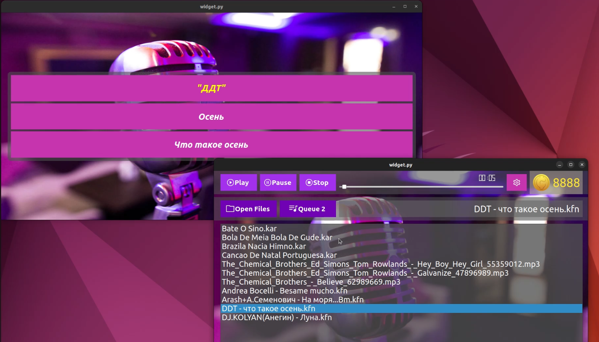

<h2>Описание</h2>

Проект караоке плеера написан на python, использовалась библиотека pyqt. Работает с kfn,kar и mp3 файлами.

<h2>Зависимости</h2>

Для запуска необходим python3, библиотека pyqt, gstreamer

Установка pyqt:

<code>pip install pyside6</code>

Установка gstreamer:

<code>sudo apt-get install libgstreamer1.0-dev libgstreamer-plugins-base1.0-dev libgstreamer-plugins-bad1.0-dev gstreamer1.0-plugins-base gstreamer1.0-plugins-good gstreamer1.0-plugins-bad gstreamer1.0-plugins-ugly gstreamer1.0-libav gstreamer1.0-tools gstreamer1.0-x gstreamer1.0-alsa gstreamer1.0-gl gstreamer1.0-gtk3 gstreamer1.0-qt5 gstreamer1.0-pulseaudio</code>
<a href="./gstreamer_freedesktop_org_documentation_installing_on_linux_.pdf">подробнее</a>
<h2>Запуск</h2>

В репозитории 2 версии программы. ver1 с паузой, ver2 без паузы.

Для запуска, в каталоге с программой запустите widget.py:

<code>python3 widget.py</code>

Привутствуют 2 видео с демострацией работы программы: <a href="https://github.com/DamirGilmanov2023/karaoke_player/blob/master/2023-04-04%2009-45-24.mkv">видео1</a>,<a href="https://github.com/DamirGilmanov2023/karaoke_player/blob/master/2023-04-04%2009-50-19.mkv">видео2</a>

